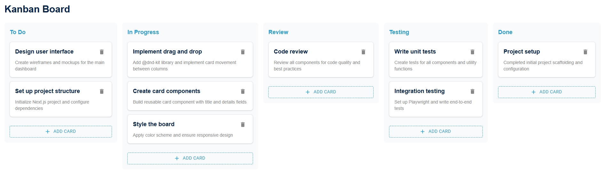

# Kanban Board

A simple Kanban project management board built with Next.js.



## Getting Started

Install dependencies:

```bash
npm install
```

Run the development server:

```bash
npm run dev
```

Open [http://localhost:3000](http://localhost:3000) in your browser.

## Available Scripts

- `npm run dev` - Start development server
- `npm run build` - Build for production
- `npm run start` - Start production server
- `npm test` - Run unit tests
- `npm run test:e2e` - Run Playwright E2E tests
